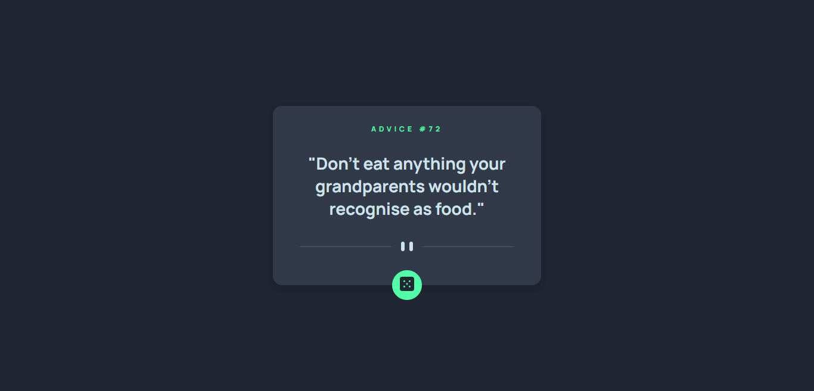

# Advice-generator-app

## Desafio do **frontend mentor**!

O [**desafio**](https://www.frontendmentor.io/challenges/advice-generator-app-QdUG-13db) consiste em construir um aplicativo gerador de conselhos
usando a [**API Advice Slip**](https://api.adviceslip.com/) e fazê-lo parecer o mais próximo possível do design.

- ### Tecnologias usadas:
  - `Html`
  - `Css`
  - `JavaScript`

### Screenshot:

Clique [**aqui**](https://renanalmeida225.github.io/Advice-generator-app/) para ver como ficou!
